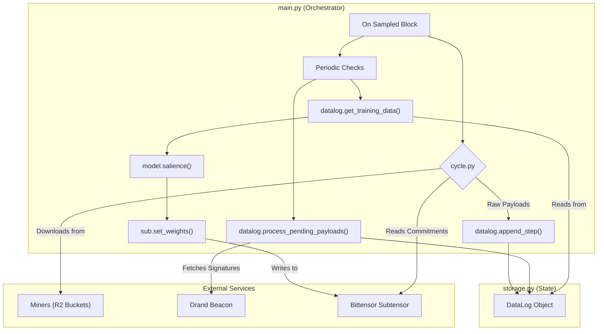

# MANTIS Bittensor Subnet Validator – Core Overview

## Purpose
A lean, performant **validator** for Bittensor subnet **123**. It is designed to evaluate and rank miners who broadcast time-locked embeddings that predict Bitcoin price movements.

The validator's core responsibilities are to:

1.  **Collect** encrypted data payloads from all active miners at regular intervals.
2.  **Securely Decrypt** the payloads using a decentralized timelock mechanism (`tlock`) powered by the Drand network.
3.  **Calculate Salience** by estimating the marginal predictive power of each miner's data using a lightweight proxy model.
4.  **Set Weights** on the Bittensor blockchain, rewarding miners proportional to their contribution.

---

## Minimal Architecture Diagram



## Core Modules

1.  **`config.py`** – A single source of truth for tunable constants like `NETUID`, `FEATURE_LENGTH`, and `LAG`.
2.  **`main.py`** – The top-level orchestrator. It runs an infinite loop that is driven by the blockchain's block height, orchestrating all data collection, processing, and weight-setting tasks at their specified intervals.
3.  **`storage.py`** – The heart of the system. It contains the `DataLog` class, which manages all historical state, including the plaintext cache and the queue of raw payloads. It is responsible for data integrity, persistence, and the entire `tlock` decryption workflow.
4.  **`cycle.py`** – A stateless utility responsible for fetching the current set of miner commitments from the subtensor and downloading their corresponding raw payloads.
5.  **`model.py`** – A lightweight MLP used to compute per-miner salience via a leave-one-out loss delta method.
6.  **`comms.py`** – Handles all asynchronous network download operations.

---

## Data Structure

The validator's entire state is encapsulated within the `DataLog` object, defined in `storage.py`. This makes the system portable and easy to manage.

```python
class DataLog:
    # Timestamps and reference prices
    blocks:         List[int]
    btc_prices:     List[float]
    
    # Decrypted, model-ready data
    plaintext_cache: List[Dict[int, List[float]]]
    
    # Queue of unprocessed encrypted payloads
    raw_payloads:   Dict[int, Dict[int, bytes]]
```

---

## End-to-End Workflow

1.  **Initialisation** – On startup, `main.py` loads the entire `DataLog` object from a local file (`mantis_datalog.pkl.gz`). If the file doesn't exist, it attempts to bootstrap its state by downloading it from the public archive URL in `config.py`.
2.  **Collection (every `SAMPLE_STEP` blocks)** – `main.py` calls `cycle.py` to fetch all miner payloads and appends the new data to the `DataLog`.
3.  **Decryption (every `PROCESS_INTERVAL` blocks)** – `main.py` triggers `datalog.process_pending_payloads()`, which finds all payloads that are now old enough to be unlocked, fetches the required Drand signatures, and decrypts them in parallel batches.
4.  **Evaluation (every `TASK_INTERVAL` blocks)** – A background thread calls `datalog.get_training_data()` to get the latest model-ready data, computes salience scores, normalizes them, and submits the new weights to the subtensor.

---

## Security Highlights

-   **Decentralized Time-lock:** Uses `tlock` and the public Drand randomness beacon, ensuring that data is verifiably locked without relying on any single party or blockchain state.
-   **Commit Validation:** The validator verifies that the filename in a miner's commit URL matches their hotkey, preventing one miner from pointing to another's data.
-   **Data Validation:** All decrypted payloads are strictly validated. Any data that is malformed (wrong length, values out of range) is safely discarded and replaced with a neutral zero vector.
-   **Payload Size Limits:** `comms.py` enforces a maximum download size to mitigate denial-of-service attacks.

---

## Dependencies

The system's core dependencies are managed in `requirements.txt`. Key libraries include:
-   `bittensor`
-   `torch`
-   `timelock`
-   `requests`, `aiohttp`

---

## Extensibility

-   Swap in an alternative salience algorithm by editing **`model.py`** only.
-   Change the data storage and processing logic by editing **`storage.py`**.
-   Increase embedding dimensionality by changing `FEATURE_LENGTH` in `config.py`.

---

## License

Released under the MIT License © 2024 MANTIS. 