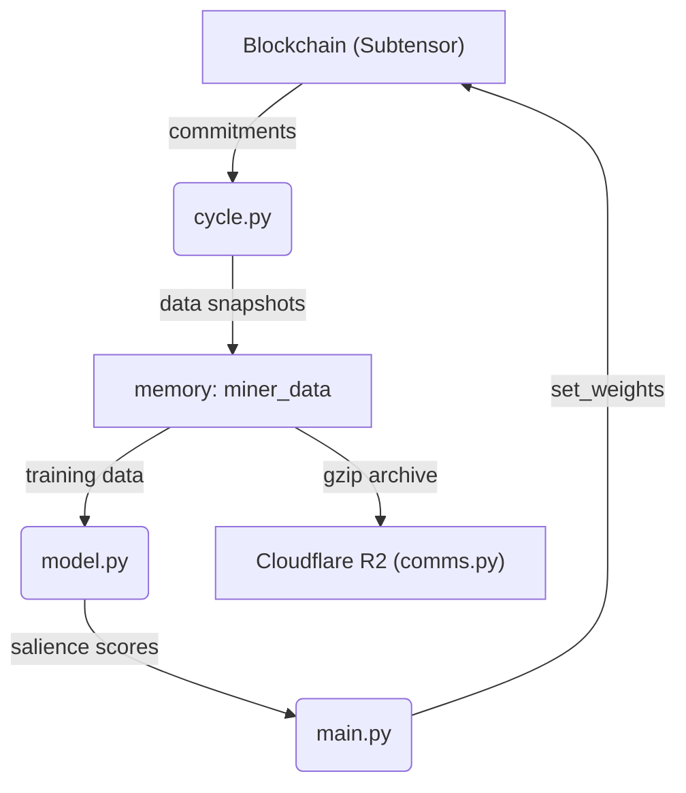

 MANTIS Bittensor Subnet Validator – Core Overview

## Purpose
A lean **validator** for Bittensor subnet **123** that ranks miners broadcasting time-locked Bitcoin-price embeddings.  The validator:

1. Collects encrypted embeddings from miners every block.
2. Caches all raw data to Cloudflare R2 for transparency.
3. Estimates **salience** – the marginal predictive power of each miner – with a proxy model.

---

## Minimal Architecture Diagram




## Core Modules

1. **`config.py`** – Single source-of-truth for tunable constants (e.g. `NUM_UIDS`, `FEATURE_LENGTH`, `LAG`, `TASK_INTERVAL`).
2. **`comms.py`** – Bidirectional I/O with Cloudflare R2.  Provides a local disk cache and simple upload/download helpers.
3. **`cycle.py`** – Ingests on-chain commitments, fetches BTC/USDT spot price, and appends `(ciphertext, block, price)` tuples to the global `miner_data` structure.
4. **`model.py`** – Lightweight MLP used to compute per-miner salience via a leave-one-out loss delta.
5. **`main.py`** – Top-level orchestrator.  Runs an infinite loop that (i) calls `cycle()` every block and (ii) recomputes & submits weights every `TASK_INTERVAL` blocks.

> **Note** Only the above five files are required for end-to-end operation.  All other scripts in the repository are auxiliary and *not* used by the live validator.

---

## Data Structure

```python
miner_data: Dict[int, {
    'uid':      int,
    'hotkey':   str | None,
    'history':  List[bytes | str],  # encrypted embeddings
    'object_url': str | None,       # R2 link advertised on-chain
    'blocks':   List[int],          # block heights when data was seen
    'btc':      List[float],        # spot price at the same height
}]
```

---

## End-to-End Workflow

1. **Initialisation** – `main.py` optionally restores `miner_data` from the last published R2 archive and connects to the network.
2. **Collection (every block)** – `cycle.py` mirrors new commitments into memory and updates the BTC reference price.
3. **Evaluation (every `TASK_INTERVAL` blocks)** – Salience is recomputed; weights are normalised and submitted via `subtensor.set_weights()`.
4. **Reward Distribution** – Miners receive Bittensor emissions proportional to their latest weight.

---

## Security Highlights

• **Time-lock encryption** prevents miners from plagiarising peer embeddings.
• **Hotkey continuity check** resets history if a miner rotates keys (sybil defence).
• **Payload size limits** mitigate denial-of-service via oversized objects.

---

## Dependencies

- `bittensor` – Blockchain client & time-lock cryptography.
- `torch` – Neural-network backbone.
- `requests`, `aiohttp` – HTTP I/O (sync & async).
- `aiobotocore`, `boto3` – Cloudflare R2 S3 compatibility.
- `numpy`, `pandas` – Numeric utilities.

---

## Extensibility

- Swap in an alternative salience algorithm by editing **`model.py`** only.
- Use a different storage backend by replacing functions in **`comms.py`**.
- Increase embedding dimensionality via `FEATURE_LENGTH`; the model adapts automatically.

---

## License

Released under the MIT License © 2024 MANTIS.
